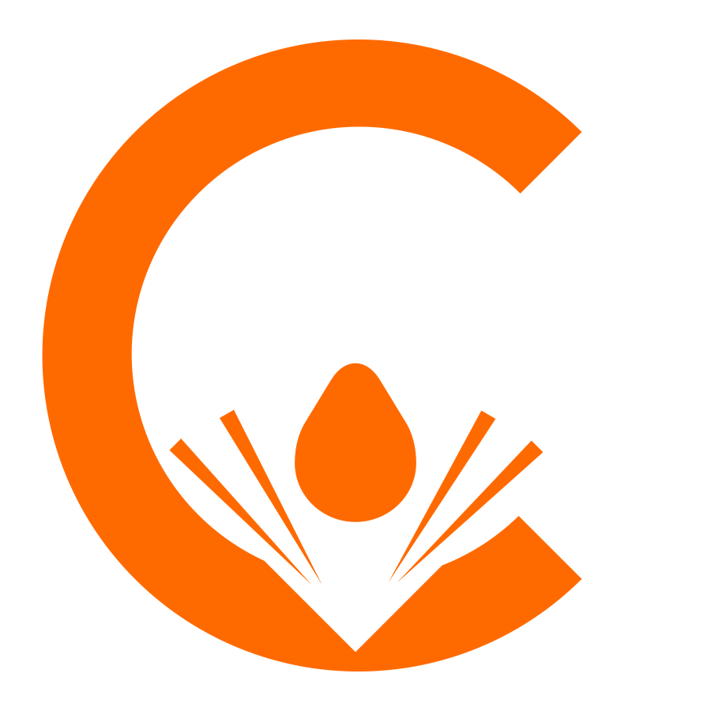

# Corrosive Components




**Corrosive Components** is a high-performance, fully customizable, and modular component library for the Qwik framework. Designed with flexibility in mind, each component in this library is self-contained and does not depend on any other component or external package. You can easily customize components using CSS variables to fit your unique design needs.

## Features

- **Independent Components**: Each component works standalone without needing other components or dependencies.
- **CSS Customization**: Customize components using CSS variables for complete control over design and appearance.
- **TypeScript Support**: Fully typed components, ensuring a robust development experience.
## Installation

To install the library in your Qwik project, use:

```bash
npm install corrosive-components
